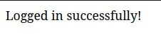

# DecoyNet : Low-Interaction Honeypots

## Project Overview

This project is a Low-Interaction honeypot designed to attract and analyze unauthorized access attempts. It consists of multiple bots designed to simulate various attack vectors, including brute force login attempts and form spam attacks. The honeypot collects data on these attacks, which can then be analyzed to improve security measures.

<div style="; justify-content: space-between;">
    
    
    
</div>
<div style="; justify-content: space-between;">
    
    
    
</div>

## Table of Contents

- [DecoyNet : Low-Interaction Honeypots](#decoynet--low-interaction-honeypots)
  - [Project Overview](#project-overview)
  - [Table of Contents](#table-of-contents)
  - [File Directory Structure](#file-directory-structure)
  - [Aim of the Honeypots](#aim-of-the-honeypots)
    - [Login Honeypot](#login-honeypot)
    - [Form Honeypot](#form-honeypot)
  - [Working of the Honeypots](#working-of-the-honeypots)
    - [Login Honeypot](#login-honeypot-1)
    - [Form Honeypot](#form-honeypot-1)
  - [Honeypot Overview](#honeypot-overview)
    - [What is a Honeypot?](#what-is-a-honeypot)
    - [Main Aim of Cybersecurity](#main-aim-of-cybersecurity)
  - [Types of Honeypots](#types-of-honeypots)
    - [Low-Interaction Honeypots](#low-interaction-honeypots)
    - [High-Interaction Honeypots](#high-interaction-honeypots)
    - [Purpose of Honeypots](#purpose-of-honeypots)
    - [Setting Up a Honeypot](#setting-up-a-honeypot)
  - [Aim of the Project](#aim-of-the-project)
    - [Honeypot Working](#honeypot-working)
    - [Project Simple Working](#project-simple-working)
    - [Difference Between Spam and Actual User Form Fill](#difference-between-spam-and-actual-user-form-fill)
      - [Real User Form Fill](#real-user-form-fill)
      - [Spam Form Fill](#spam-form-fill)
  - [Bots](#bots)
    - [BreachBot](#breachbot)
    - [Form Spam Attack Bot](#form-spam-attack-bot)
  - [Usage](#usage)
    - [Running the Honeypot Application](#running-the-honeypot-application)
    - [Running the Attack Bots](#running-the-attack-bots)
  - [Installation and Setup](#installation-and-setup)
    - [1. **Clone the Repository**](#1-clone-the-repository)
    - [2. **Update and Upgrade System** (for fresh Linux environments)](#2-update-and-upgrade-system-for-fresh-linux-environments)
    - [3. **Install Python and Pip** (if not already installed)](#3-install-python-and-pip-if-not-already-installed)
    - [4. **Install venv Package** (if not already installed)](#4-install-venv-package-if-not-already-installed)
    - [5. **Create and Activate a Virtual Environment**](#5-create-and-activate-a-virtual-environment)
    - [6. **Install Project Dependencies**](#6-install-project-dependencies)
    - [7. **Run the Honeypot Application**](#7-run-the-honeypot-application)
    - [8. **Run Attack Bots**](#8-run-attack-bots)
    - [9. **Run the Flask Application** (if applicable)](#9-run-the-flask-application-if-applicable)
    - [10. **Deactivate the Virtual Environment**](#10-deactivate-the-virtual-environment)
    - [Summary of Commands](#summary-of-commands)
  - [Links and References](#links-and-references)

## File Directory Structure

```plaintext
DecoyNet
├── Archive
│   ├── bot.py
│   ├── dashboard.py
│   └── README.md
├── breachbot.py
├── data
│   ├── bot_trace.csv
│   ├── login.csv
│   ├── spams.csv
│   └── submissions.csv
├── formhpot.py
├── formspamattack.py
├── loginhpot.py
├── README.md
├── requirements.txt
├── ss
├── static
│   ├── bg.png
│   └── styles.css
└── templates
    ├── dashboard.html
    ├── form.html
    ├── index.html
    └── login.html

```

## Aim of the Honeypots

### Login Honeypot

**Aim**: The primary aim of the login honeypot is to simulate a vulnerable login endpoint that attracts brute force attack attempts. This honeypot is designed to detect and log unauthorized login attempts, which typically involve systematic trials of different password combinations. By capturing this data, the honeypot helps in understanding common attack patterns, identifying weak passwords, and improving overall security measures. It provides insights into attackers’ strategies and tools used during such attacks.

### Form Honeypot

**Aim**: The form honeypot aims to simulate a vulnerable form on a web application to attract and detect spam attacks. By including hidden fields that only automated spam bots would fill, it differentiates between legitimate user interactions and spam submissions. This honeypot helps in understanding the nature of spam attacks, the types of data bots are trying to submit, and the frequency of such attacks. It aids in refining anti-spam mechanisms and enhances the robustness of form validation strategies.

---

## Working of the Honeypots

### Login Honeypot

- **Simulation**: The login honeypot sets up a Flask server with an endpoint that appears to accept login credentials. The endpoint is intentionally vulnerable to attract brute force attacks.


- **Interaction**: When an attacker tries to gain unauthorized access, they use automated tools to attempt various username-password combinations. The honeypot logs these attempts, including the IP addresses, timestamps, and the passwords used.


- **Logging**: Each login attempt is captured and stored in a CSV file for analysis. This data includes failed login attempts and the patterns used by attackers.



```
Honeypot triggered! Potential spam detected.
127.0.0.1 - - [23/Jul/2024 15:59:18] "POST /submit HTTP/1.1" 302 -
127.0.0.1 - - [23/Jul/2024 15:59:18] "GET / HTTP/1.1" 200 -
Real ID: None, Real Password: None
Honeypot ID: None, Honeypot Password: aano
```


- **Analysis**: The logged data is analyzed to identify common password combinations, attack frequency, and potential vulnerabilities. This analysis helps in understanding attacker behavior and strengthening security protocols.

```
Timestamp,IP Address,User Agent,hpot ID,hpot Password
2024-07-23 15:59:17,127.0.0.1,python-requests/2.32.3,,aaaa
2024-07-23 15:59:17,127.0.0.1,python-requests/2.32.3,,aaab
2024-07-23 15:59:17,127.0.0.1,python-requests/2.32.3,,aaac
2024-07-23 15:59:17,127.0.0.1,python-requests/2.32.3,,aaad
2024-07-23 15:59:17,127.0.0.1,python-requests/2.32.3,,aaae
2024-07-23 15:59:17,127.0.0.1,python-requests/2.32.3,,aaaf
2024-07-23 15:59:17,127.0.0.1,python-requests/2.32.3,,aaag
2024-07-23 15:59:17,127.0.0.1,python-requests/2.32.3,,aaah
```

### Form Honeypot

1. **Simulation**: The form honeypot sets up a Flask server with a form containing both visible and hidden fields. The hidden fields are designed to attract spam bots, which typically fill all fields, including those not meant for legitimate users.
```
(myenv) kintsugi-warrior@kintsugi-machine:~/Documents/Warehouse2.0/Projects/DecoyNet$ python formhpot.py
 * Serving Flask app 'formhpot'
 * Debug mode: on
WARNING: This is a development server. Do not use it in a production deployment. Use a production WSGI server instead.
 * Running on http://127.0.0.1:5000
Press CTRL+C to quit
 * Restarting with stat
 * Debugger is active!
 * Debugger PIN: 288-869-580
127.0.0.1 - - [23/Jul/2024 16:08:11] "GET / HTTP/1.1" 200 -
127.0.0.1 - - [23/Jul/2024 16:08:11] "GET /static/styles.css HTTP/1.1" 200 -
127.0.0.1 - - [23/Jul/2024 16:08:51] "GET /form HTTP/1.1" 200 -
127.0.0.1 - - [23/Jul/2024 16:08:51] "GET /static/styles.css HTTP/1.1" 304 -
127.0.0.1 - - [23/Jul/2024 16:10:23] "POST /submit HTTP/1.1" 200 -
```
2. **Interaction**: Legitimate users fill only the visible fields, leaving the hidden fields empty. In contrast, spam bots automatically fill in both the visible and hidden fields with random or spammy data.


3. **Detection**: Upon form submission, the server checks the hidden fields. If any hidden fields are filled, the submission is identified as spam. The data is discarded, and the spam attempt is logged.


```
Timestamp,IP Address,User Agent,hpot ID,hpot Name,hpot Option,hpot Phone,hpot Email,hpot Review
2024-07-22 20:40:15,127.0.0.1,python-requests/2.32.3,74848,XBBWL AWRXY,excellent,2095471582,kvjn8oeo@lrato.com,"Average service, could be better."
2024-07-22 20:40:15,127.0.0.1,python-requests/2.32.3,72322,NPCTQ BIDVI,poor,0084984062,xg49cz8e@cbahe.com,"Great experience, will come back again."
2024-07-22 20:40:15,127.0.0.1,python-requests/2.32.3,80129,PGSBQ OZMXT,excellent,5318343996,vy5fef90@wknyg.com,"Great experience, will come back again."
2024-07-22 20:40:15,127.0.0.1,python-requests/2.32.3,85569,VIBLO YGVYH,average,8186494463,x1tz5o46@ywkfu.com,"Average service, could be better."
2024-07-22 20:40:15,127.0.0.1,python-requests/2.32.3,31201,BONKT CDODY,good,4407142378,vn816mwl@nkbqj.com,"Amazing product, very happy with the purchase!"
2024-07-22 20:40:15,127.0.0.1,python-requests/2.32.3,66029,EMBVN QXDIH,average,4729452213,hotck1ce@jxxca.com,"Average service, could be better."2024-07-23 16:12:48,127.0.0.1,python-requests/2.32.3,35335,EXVWG YQUAX,good,5967818097,r43zj7a1@inldd.com,"Average service, could be better."
```
4. **Analysis**: The data from spam attempts is collected and analyzed to understand spammer tactics, such as the types of data submitted and the frequency of attacks. This information is used to improve form validation and anti-spam mechanisms.


## Honeypot Overview

### What is a Honeypot?

A honeypot is a security mechanism set to detect, deflect, or, in some manner, counteract attempts at unauthorized use of information systems. It consists of a computer, data, or a network site that appears to be part of a network but is actually isolated and monitored, and which seems to contain information or resources that would be of value to attackers.

### Main Aim of Cybersecurity

The main aim of cybersecurity is to protect systems, networks, and data from cyber attacks. This involves preventing unauthorized access, ensuring data integrity, and maintaining the availability of resources.

## Types of Honeypots

### Low-Interaction Honeypots
- **Definition**: Simulate only a few aspects of the targeted system.
- **Purpose**: Capture basic information about attack vectors and techniques.
- **Advantages**: Easier to deploy and manage, lower risk.
- **Disadvantages**: Limited information on attackers' behavior and tactics.

### High-Interaction Honeypots
- **Definition**: Fully functional systems that interact with attackers in a more realistic way.
- **Purpose**: Gather detailed information about attackers' methods and tools.
- **Advantages**: Comprehensive data collection, deeper insights into attacker strategies.
- **Disadvantages**: Higher risk, more complex to deploy and maintain.

### Purpose of Honeypots
- **Detection**: Identify unauthorized access and attacks.
- **Deception**: Mislead attackers and waste their time and resources.
- **Research**: Understand new attack techniques and develop countermeasures.
- **Forensics**: Collect evidence and analyze attack patterns for legal or analytical purposes.

### Setting Up a Honeypot
1. **Planning**: Define objectives and choose the type of honeypot.
2. **Configuration**: Set up the honeypot system, ensuring it mimics real systems.
3. **Isolation**: Keep the honeypot isolated from the actual network to prevent accidental breaches.
4. **Monitoring**: Continuously monitor and log all activities within the honeypot.
5. **Analysis**: Regularly analyze the collected data to gain insights into attack patterns and behaviors.

## Aim of the Project

The aim of this project is to create a honeypot that can attract and log various types of cyber attacks. This information can then be analyzed to improve security measures and to better understand attacker behavior.

### Honeypot Working

The honeypot application runs a Flask server that simulates a vulnerable web application. It logs all incoming requests, including attempted logins and form submissions, and stores this data in a CSV file. This data is then used for analysis.


- **Real Users**: Interact with and fill only the visible fields. The honeypot fields remain empty.
- **Spam Bots**: Fill both the visible and hidden fields, triggering the honeypot detection.

This differentiation allows the server to identify and filter out spam submissions while processing legitimate ones.

### Project Simple Working

1. **Honeypot Flask Application:**

    - The Flask application runs a web server with endpoints that appear vulnerable to attackers.
    - It logs all incoming requests, including IP addresses, timestamps, and payloads.
    - Data is stored in .
    - **Login Honeypot Server:** Simulates a decoy brute force attack security mechanism set to detect&deflect,by trying multiple password combinations on the login endpoint.
    - **Form Honeypot :** Simulates a security mechanism set to detect&deflect spam attack by submitting multiple forms with random data.

2. **Attack Bots:**

    - **Breach Bot:** Simulates a brute force attack by trying multiple password combinations on the login endpoint.
    - **Form Spam Attack Bot:** Simulates a spam attack by submitting multiple forms with random data.

3. **Data Analysis:**

    - The `analysis/analyze_data.py` script analyzes the collected data and generates visualizations.
### Difference Between Spam and Actual User Form Fill

#### Real User Form Fill

1. **User Interaction**:
   - A real user visits the form page and interacts with the visible fields only.
   - The user fills in the fields with obfuscated names (`nameksljf`, `emaillkjkl`) and leaves the hidden honeypot fields (`name`, `email`) untouched.

2. **Form Data Submission**:
   - Upon form submission, the form data sent to the server includes values only for the obfuscated fields.
   - The honeypot fields remain empty.

3. **Server-Side Processing**:
   - The server checks the honeypot fields.
   - Since the honeypot fields are empty, the submission is considered legitimate.
   - The server then processes the real user data (e.g., saving it to a CSV file).

4. **Outcome**:
   - The user receives a confirmation message indicating that the form submission was successful.

#### Spam Form Fill

1. **Bot Interaction**:
   - A spam bot visits the form page and attempts to fill all input fields indiscriminately, including hidden fields.
   - The bot fills in the visible fields as well as the honeypot fields with generic or spammy data.

2. **Form Data Submission**:
   - Upon form submission, the form data sent to the server includes values for both the visible fields and the hidden honeypot fields.

3. **Server-Side Processing**:
   - The server checks the honeypot fields.
   - Since the honeypot fields are filled, the submission is identified as spam.
   - The server discards the spam submission and may take additional actions (e.g., logging the spam attempt).

4. **Outcome**:
   - The bot does not receive any confirmation, and the spam data is not processed or saved by the server.

## Bots

### BreachBot

This bot simulates a brute force attack by trying various password combinations on a login endpoint. It uses the `requests` library to send POST requests and logs the results.

### Form Spam Attack Bot

This bot simulates a form spam attack by submitting multiple forms with random data. It uses the `requests` library to send POST requests to the form endpoint.

This bot combines various attack methods to simulate a more comprehensive breach attempt.

## Usage

### Running the Honeypot Application

```bash
python loginhpot.py
```

```bash
python formhpot.py
```

### Running the Attack Bots

**Brute Force Login Bot:**

```bash
python breachbot.py
```

**Form Spam Attack Bot:**

```bash
python formspamattack.py
```

## Installation and Setup
Here's List of Steps which integrates the steps for cloning a repository, setting up a virtual environment, and configuring a Python Flask project:

### 1. **Clone the Repository**

Clone your project repository from GitHub:

```bash
git clone https://github.com/yourusername/honeypot_project.git
cd honeypot_project
```

### 2. **Update and Upgrade System** (for fresh Linux environments)

Update and upgrade your system packages:

```bash
sudo apt update
sudo apt upgrade
```

### 3. **Install Python and Pip** (if not already installed)

Install Python and Pip:

```bash
sudo apt install python3 python3-pip
```

### 4. **Install venv Package** (if not already installed)

Install the `venv` package for creating virtual environments:

```bash
sudo apt install python3-venv
```

### 5. **Create and Activate a Virtual Environment**

Create and activate a virtual environment named `myenv`:

```bash
python3 -m venv myenv
source myenv/bin/activate  # On macOS and Linux
# myenv\Scripts\activate  # On Windows
```

### 6. **Install Project Dependencies**

Install the required packages listed in the `requirements.txt` file:

```bash
pip install -r requirements.txt
```

### 7. **Run the Honeypot Application**

Execute the honeypot application:

```bash
python loginhpot.py
python formhpot.py

```

### 8. **Run Attack Bots**

Run any attack bots as required for your project:

```bash
python bot_scripts/brute_force_login.py
python bot_scripts/form_spam_attack.py
```

### 9. **Run the Flask Application** (if applicable)

If your project includes a Flask application, run it:

```bash
python loginhpot.py
python formhpot.py

```

Access the Flask app at `http://127.0.0.1:5000` in your browser.

### 10. **Deactivate the Virtual Environment**

When you're done working, deactivate the virtual environment:

```bash
deactivate
```

### Summary of Commands

```bash
# Clone repository
git clone https://github.com/yourusername/honeypot_project.git
cd honeypot_project

# System update
sudo apt update
sudo apt upgrade

# Install Python and pip
sudo apt install python3 python3-pip

# Install venv
sudo apt install python3-venv

# Create and activate virtual environment
python3 -m venv myenv
source myenv/bin/activate

# Install dependencies
pip install -r requirements.txt

# Run applications
python loginhpot.py
python formhpot.py

python brute_force_login.py
python form_spam_attack.py
# Or run Flask app if applicable
python loginhpot.py
python formhpot.py


# Deactivate virtual environment
deactivate
```

This guide should help you set up your project environment efficiently and cover all the necessary steps for a Python-based project on Linux.

## Links and References

- [Flask Documentation](https://flask.palletsprojects.com/)
- [Requests Documentation](https://requests.readthedocs.io/)
- [Pandas Documentation](https://pandas.pydata.org/)
- [Plotly Documentation](https://plotly.com/python/)
